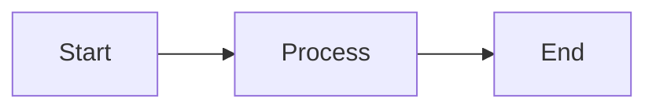

# Documentation Style Guide

**Assume technical competence.** Users know how to create files, edit configs, and use coding agents.

## Core Principles

- **Don't document expected behavior** - If your target audience already expects it, don't state it
- **Don't document obvious details** - Implementation details that "just work" don't need explanation
- **State mechanics once** - If implications or use cases are clear from the description, don't list them separately
- **Document what's different** - Deviations from expectations, gotchas, design decisions
- **Document what's complex** - Multi-step workflows, non-obvious interactions, tradeoffs

## Assumed Knowledge

Users are familiar with:

- Other coding agents (Cursor, Windsurf, Aider, etc.)
- Git worktrees and workspace concepts
- Instruction files (AGENTS.md, .cursorrules, etc.)
- Basic prompt engineering

## Examples of What NOT to Document

❌ "The cursor is always visible, even on empty text" - Expected Vim behavior, trivial detail

❌ "The save button is in the top right" - Obvious from UI, no cognitive value

❌ "Press Enter to submit" - Universal convention, doesn't need stating

## Examples of What TO Document

✅ "ESC exits normal mode instead of canceling edits (use Ctrl-Q)" - Different from expected behavior

✅ "Column position is preserved when moving up/down" - Non-obvious Vim feature some users don't know

✅ "Operators compose with motions: d + w = dw" - Core concept that unlocks understanding

## Mermaid Diagrams

When creating diagrams:

- Avoid side-by-side subgraphs (they display too wide)
- For comparisons, use separate diagram blocks or single graph with visual separation
- When using custom fill colors, include contrasting color property (e.g., "style note fill:#ff6b6b,color:#fff")
- Wrap node labels containing brackets or special characters in quotes

Example:

````markdown

````
