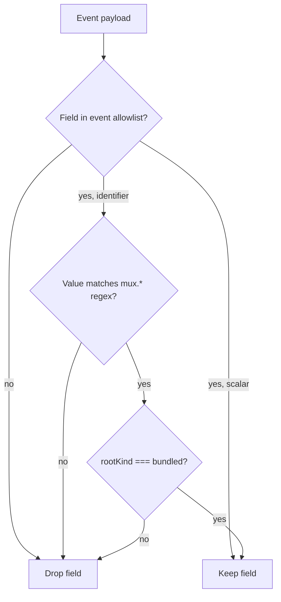

The Extension Telemetry layer wraps the host
[Telemetry service](/reference/telemetry) and applies a **closed
allowlist** plus a **provenance gate** before any Extension event
leaves the device. This page lists every v1 event, its allowlisted
fields, and the gate rules — so users (and auditors) can verify that
the only string identifiers that ever ship are bundled-Extension
identifiers under the `mux.*` reserved prefix.

The full source is in
[`src/common/extensions/extensionTelemetry.ts`](https://github.com/coder/mux/blob/main/src/common/extensions/extensionTelemetry.ts);
this page mirrors that file so it stays auditable without reading
TypeScript.

## Privacy guarantees

The Extension Telemetry layer **never** emits:

- project paths or package names
- third-party Extension identifiers (`extensionId`, `contributionId`)
- requested-capability lists
- file paths or lockfile contents
- any field not on the per-event allowlist below

Aggregate state is surfaced via counts (`extensionCount`,
`capabilityCount`, `diagnosticCount`) instead of identifiers.

The host-level `MUX_DISABLE_TELEMETRY=1` switch disables this layer
along with everything else; see
[Telemetry overview](/reference/telemetry).

## The provenance gate

Each allowlisted field is classified as one of two kinds:

| Kind         | Behavior                                                                                    |
| ------------ | ------------------------------------------------------------------------------------------- |
| `scalar`     | Counts, durations (ms), booleans, status enums, diagnostic codes, severity. Always allowed. |
| `identifier` | `extensionId` / `contributionId` style fields. Only emitted if **both** gates below pass.   |

Identifier fields ship only if **both** of these are true:

1. The value matches the **Reserved Extension Identity Prefix** regex
   `^mux(\..*)?$`.
2. The Extension's source `rootKind === "bundled"`.

Either gate failing strips the field. Defense-in-depth means a
third-party Extension squatting on the `mux.*` namespace is still
rejected because its `rootKind !== "bundled"`; a bundled Extension
with a non-Mux id is rejected because the regex fails.

## v1 events catalog

Every event in the table below is a `ExtensionTelemetryEventName`. The
"Fields" column lists the allowlisted property keys; values for
`identifier` fields are gated as described above, values for `scalar`
fields are kept as-is when they are `string | number | boolean`.

### `extensions.discovery.completed`

Emitted once per Discovery cycle that finishes (per root or
aggregated, per the host wiring). Used to monitor cold-start budgets
and discovery success rates.

| Field               | Kind   | Notes                                                                |
| ------------------- | ------ | -------------------------------------------------------------------- |
| `durationMs`        | scalar | End-to-end duration of the discovery cycle.                          |
| `rootCount`         | scalar | Number of Extension Roots considered.                                |
| `extensionCount`    | scalar | Number of Extensions surfaced (any state).                           |
| `contributionCount` | scalar | Number of Available + Inspection-only contributions in the snapshot. |
| `diagnosticCount`   | scalar | Total diagnostics carried by the snapshot.                           |
| `cacheHit`          | scalar | `true` when the inspection-path snapshot cache was warm.             |

### `extensions.discovery.failed`

Emitted when a per-root Discovery Attempt fails (timeout, malformed
root manifest, etc.). One event per failed root.

| Field            | Kind   | Notes                                                    |
| ---------------- | ------ | -------------------------------------------------------- |
| `rootKind`       | scalar | One of `bundled`, `userGlobal`, `projectLocal`.          |
| `diagnosticCode` | scalar | Stable diagnostic code (e.g., `root.discovery.timeout`). |
| `durationMs`     | scalar | Duration before the attempt was abandoned.               |

### `extensions.migration.activated`

Emitted when a built-in feature is migrated onto an Extension
contribution at runtime (future migration releases). Identifier
fields apply because only bundled (and therefore `mux.*`) Extensions
are eligible to drive a host migration.

| Field         | Kind       | Notes                                                                                                |
| ------------- | ---------- | ---------------------------------------------------------------------------------------------------- |
| `extensionId` | identifier | Bundled `mux.*` id only — third-party Extensions cannot trigger this event because the gate rejects. |
| `durationMs`  | scalar     | Activation duration.                                                                                 |

### `extensions.consent.shortcut.accepted`

Emitted when a user confirms the Consent Shortcut.

| Field      | Kind   | Notes                                        |
| ---------- | ------ | -------------------------------------------- |
| `rootKind` | scalar | Source root of the Extension being approved. |

### `extensions.consent.shortcut.rejected`

Emitted when a user dismisses the Consent Shortcut without confirming.

| Field      | Kind   | Notes                                        |
| ---------- | ------ | -------------------------------------------- |
| `rootKind` | scalar | Source root of the Extension being reviewed. |

### `extensions.approval.recorded`

Emitted when an Approval Record is written.

| Field             | Kind       | Notes                                               |
| ----------------- | ---------- | --------------------------------------------------- |
| `extensionId`     | identifier | Bundled-only via the gate.                          |
| `rootKind`        | scalar     | Source root.                                        |
| `capabilityCount` | scalar     | Total number of approved capabilities (post-merge). |

### `extensions.approval.revoked`

Emitted when an Approval Record is removed.

| Field         | Kind       | Notes                      |
| ------------- | ---------- | -------------------------- |
| `extensionId` | identifier | Bundled-only via the gate. |
| `rootKind`    | scalar     | Source root.               |

### `extensions.enabled.toggled`

Emitted when an Extension's enabled state changes.

| Field         | Kind       | Notes                      |
| ------------- | ---------- | -------------------------- |
| `extensionId` | identifier | Bundled-only via the gate. |
| `rootKind`    | scalar     | Source root.               |
| `enabled`     | scalar     | New enabled state.         |

### `extensions.reload.invoked`

Emitted when **Reload Extensions** runs (palette, watcher, or
section button).

| Field        | Kind   | Notes                                                                      |
| ------------ | ------ | -------------------------------------------------------------------------- |
| `rootKind`   | scalar | Source root being reloaded; absent / aggregated for whole-platform reload. |
| `durationMs` | scalar | Reload duration.                                                           |

### `extensions.cache.miss`

Emitted when the Snapshot Cache is consulted on cold start and rejects
the cached payload.

| Field    | Kind   | Notes                                                                                                                 |
| -------- | ------ | --------------------------------------------------------------------------------------------------------------------- |
| `reason` | scalar | One of `appVersionMismatch`, `manifestVersionMismatch`, `stateFileMtimeMismatch`, `stateFileHashMismatch`, `missing`. |

### `extensions.cache.hit`

Emitted when the Snapshot Cache is consulted on cold start and the
cached payload survives validation.

| Field        | Kind   | Notes                                  |
| ------------ | ------ | -------------------------------------- |
| `durationMs` | scalar | Time saved by the cache hit (approx.). |

### `extensions.diagnostic.emitted`

Emitted once per Extension Diagnostic that crosses the structured-log
sink. The matrix of which diagnostics surface where is documented in
the Settings → Extensions UI; this event is the telemetry-side mirror.

| Field            | Kind       | Notes                                                              |
| ---------------- | ---------- | ------------------------------------------------------------------ |
| `extensionId`    | identifier | Bundled-only via the gate; absent for root-level diagnostics.      |
| `contributionId` | identifier | Bundled-only via the gate; absent for extension-level diagnostics. |
| `diagnosticCode` | scalar     | Stable diagnostic code (e.g., `extension.identity.conflict`).      |
| `severity`       | scalar     | `error`, `warn`, or `info`.                                        |
| `rootKind`       | scalar     | Source root.                                                       |

## Auditing locally

To verify in your own session:

1. Run `bun run debug extensions` and inspect the snapshot.
2. Trigger a few Extension events (reload, run the Consent Shortcut on a
   third-party Extension).
3. Watch the dev tools / PostHog console for outgoing events; confirm
   that any `extensionId` or `contributionId` field present has the
   `mux.*` prefix and that the host can confirm the event came from
   the bundled root.

A regression-test suite under
[`src/common/extensions/extensionTelemetry.test.ts`](https://github.com/coder/mux/blob/main/src/common/extensions/extensionTelemetry.test.ts)
asserts that the gate rejects every catalog event under a non-bundled
`rootKind` and that any field outside the per-event allowlist is
dropped. Adding a new event requires both an entry in the allowlist
table and a corresponding regression test.

## Related

- [Extension Authoring Quickstart](/extensions/authoring) — manifest
  reference and identity rules.
- [Release Checklist](/extensions/release-checklist) — step 10 covers
  the dogfood telemetry spot-check.
- [Telemetry overview](/reference/telemetry) — host-level telemetry
  policy and the `MUX_DISABLE_TELEMETRY` switch.
