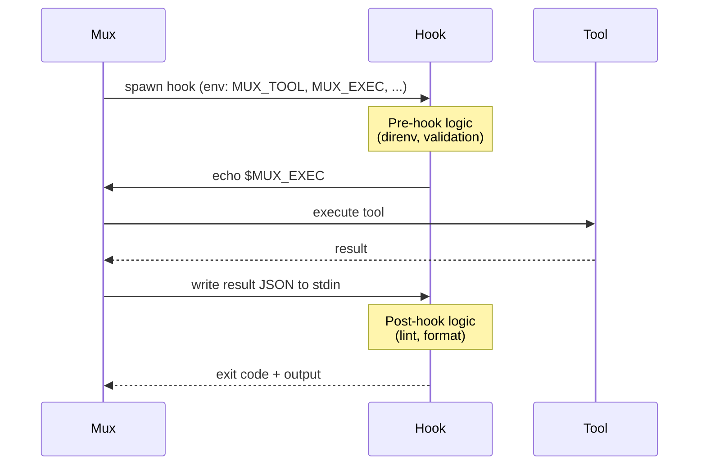

Add a `.mux/tool_hook` executable to your project to wrap every tool execution. Use it for linting, type-checking, blocking dangerous operations, or any custom validation.

<Tip>
  **Looking to set up direnv, nvm, or virtualenv?** Use
  [`.mux/tool_env`](#environment-setup-with-tool_env) instead—it's simpler and specifically designed
  for environment setup.
</Tip>

## Quick Start

Create `.mux/tool_hook`:

```bash
#!/usr/bin/env bash
set -euo pipefail

# ─────────────────────────────────────────────────────────────────────────────
# PRE-HOOK: Runs before the tool executes
# ─────────────────────────────────────────────────────────────────────────────

# Example: block dangerous operations
if [[ "$MUX_TOOL" == "bash" ]]; then
  if [[ -n "${MUX_TOOL_INPUT_PATH:-}" ]]; then
    input_json=$(cat "$MUX_TOOL_INPUT_PATH")
  else
    input_json=$MUX_TOOL_INPUT
  fi
  if echo "$input_json" | jq -r '.script' | grep -q 'push.*--force'; then
    echo "Force push blocked by tool_hook" >&2
    exit 1
  fi
fi

# ─────────────────────────────────────────────────────────────────────────────
# SIGNAL: Tell mux to execute the tool
# $MUX_EXEC is a unique marker generated per invocation (prevents accidents)
# ─────────────────────────────────────────────────────────────────────────────
echo "$MUX_EXEC"

# ─────────────────────────────────────────────────────────────────────────────
# POST-HOOK: Runs after the tool completes
# Tool result is sent to stdin as JSON; read it with a timeout to avoid hangs
# ─────────────────────────────────────────────────────────────────────────────
read -t 300 MUX_RESULT || exit 0  # 5 min timeout; exit cleanly if mux disconnects

# Run linters after file edits
if [[ "$MUX_TOOL" == file_edit_* ]]; then
  if [[ -n "${MUX_TOOL_INPUT_PATH:-}" ]]; then
    input_json=$(cat "$MUX_TOOL_INPUT_PATH")
  else
    input_json=$MUX_TOOL_INPUT
  fi

  file=$(echo "$input_json" | jq -r '.file_path // empty')
  [[ -z "$file" ]] && exit 0

  # Check Python files with ruff (non-zero exit feeds back to agent)
  if [[ "$file" == *.py ]]; then
    ruff check "$file" 2>&1 || exit 1
  fi
fi
```

Make it executable:

```bash
chmod +x .mux/tool_hook
```

## How It Works

The hook wraps the entire tool lifecycle in a single invocation:



This design lets you:

- **Set up environment** before tools run (direnv, virtualenv, nvm)
- **Block tools** by exiting before `$MUX_EXEC`
- **Inspect results** and run validation after tools complete
- **Share state** between pre and post logic

## Environment Variables

| Variable              | Description                                                                    |
| --------------------- | ------------------------------------------------------------------------------ |
| `MUX_EXEC`            | Unique marker to echo when ready for tool execution (e.g., `MUX_EXEC_a1b2...`) |
| `MUX_TOOL`            | Tool name: `bash`, `file_edit_replace_string`, `file_read`, etc.               |
| `MUX_TOOL_INPUT`      | JSON string with tool arguments (may be `__MUX_TOOL_INPUT_FILE__` if large)    |
| `MUX_TOOL_INPUT_PATH` | Path to a file containing the full JSON tool input (set when input is large)   |
| `MUX_WORKSPACE_ID`    | Current workspace identifier                                                   |
| `MUX_PROJECT_DIR`     | Workspace root directory                                                       |

After printing `$MUX_EXEC`, the tool result is sent to stdin as a single JSON line. Read it with `read -t 300 MUX_RESULT` (use a timeout to avoid hangs if mux disconnects).

If `MUX_TOOL_INPUT_PATH` is set, prefer reading tool args from that file (tool inputs can be too large to safely pass via env vars, especially over SSH).

## Exit Codes

| Exit Code | Behavior                                          |
| --------- | ------------------------------------------------- |
| `0`       | Success - tool result returned to agent           |
| Non-zero  | Failure - agent sees error and can attempt to fix |

If the hook exits non-zero **before** `$MUX_EXEC`, the tool is blocked entirely and the agent sees the error.

If the hook exits non-zero **after** `$MUX_EXEC`, the tool has already run but the agent sees the hook's error output (useful for lint/type failures).

## Timeouts

Tool hooks are expected to be fast. To avoid hung hooks blocking the agent forever, mux enforces phase timeouts:

- **Pre-hook timeout**: the hook must print `$MUX_EXEC` within 5 minutes (otherwise the tool is not run)
- **Post-hook timeout**: after mux sends the tool result to stdin, the hook must exit within 5 minutes

Long-running tools (e.g. tests/builds) do **not** count against these timeouts.

<Tip>
  Always use `read -t 300 MUX_RESULT` (with a timeout) instead of bare `read MUX_RESULT`. If mux
  crashes or disconnects before sending the result, a bare `read` will hang forever. The timeout
  ensures your hook exits cleanly.
</Tip>

## Hook Output

The agent always sees hook output (stdout after `$MUX_EXEC`, plus stderr) in the `hook_output` field of the tool result. This lets you communicate what the hook did—for example, if a formatter modified the file:

```bash
#!/usr/bin/env bash

echo "$MUX_EXEC"
read -t 300 MUX_RESULT

if [[ "$MUX_TOOL" == file_edit_* ]]; then
  input_json=$MUX_TOOL_INPUT
  if [[ -n "$MUX_TOOL_INPUT_PATH" ]]; then
    input_json=$(cat "$MUX_TOOL_INPUT_PATH")
  fi

  file=$(echo "$input_json" | jq -r '.file_path')
  if prettier --write "$file" 2>/dev/null; then
    echo "Formatted: $file" >&2  # Agent sees this in hook_output
  fi
fi
```

The agent receives:

```json
{ "diff": "...", "hook_output": "Formatted: src/foo.ts" }
```

This is especially useful for file edits where a formatter modifies the file after the edit—the agent sees the original diff plus a notification that formatting was applied.

## Examples

### Environment Setup (direnv/devenv)

The most common use case - ensure tools see your development environment:

```bash
#!/usr/bin/env bash

# Load direnv environment
eval "$(direnv export bash 2>/dev/null)"

# Or activate a Python virtualenv
# source .venv/bin/activate

# Or use nvm
# source ~/.nvm/nvm.sh && nvm use

echo "$MUX_EXEC"
read -t 300 MUX_RESULT
```

### Lint After File Edits

Run linters after any file modification:

```bash
#!/usr/bin/env bash

echo "$MUX_EXEC"
read -t 300 MUX_RESULT

# Only lint after file edits
if [[ "$MUX_TOOL" == file_edit_* ]]; then
  input_json=$MUX_TOOL_INPUT
  if [[ -n "$MUX_TOOL_INPUT_PATH" ]]; then
    input_json=$(cat "$MUX_TOOL_INPUT_PATH")
  fi

  file=$(echo "$input_json" | jq -r '.file_path')

  case "$file" in
    *.ts|*.tsx)
      npx tsc --noEmit "$file" 2>&1 || exit 1
      ;;
    *.py)
      ruff check "$file" 2>&1 || exit 1
      ;;
  esac
fi
```

### Block Dangerous Operations

Prevent certain tools or patterns:

```bash
#!/usr/bin/env bash

# Block force pushes
if [[ "$MUX_TOOL" == "bash" ]]; then
  input_json=$MUX_TOOL_INPUT
  if [[ -n "$MUX_TOOL_INPUT_PATH" ]]; then
    input_json=$(cat "$MUX_TOOL_INPUT_PATH")
  fi

  if echo "$input_json" | jq -r '.script' | grep -q 'push.*--force'; then
    echo "Force push blocked by tool_hook" >&2
    exit 1
  fi
fi

echo "$MUX_EXEC"
read -t 300 MUX_RESULT
```

### Measure Tool Duration

Track how long tools take:

```bash
#!/usr/bin/env bash

start=$(date +%s%N)

echo "$MUX_EXEC"
read -t 300 MUX_RESULT

end=$(date +%s%N)
duration=$(( (end - start) / 1000000 ))
echo "Tool $MUX_TOOL took ${duration}ms" >> /tmp/mux-tool-timing.log
```

### Python Hook

Hooks can be written in any language:

```python
#!/usr/bin/env python3
import os
import sys
import json

tool = os.environ.get('MUX_TOOL', '')

tool_input_path = os.environ.get('MUX_TOOL_INPUT_PATH')
if tool_input_path:
    with open(tool_input_path, 'r', encoding='utf-8') as f:
        tool_input_raw = f.read()
else:
    tool_input_raw = os.environ.get('MUX_TOOL_INPUT', '{}')

tool_input = json.loads(tool_input_raw)

# Pre-hook logic here

print(os.environ['MUX_EXEC'], flush=True)
result = json.loads(input())

# Post-hook logic here
if tool.startswith('file_edit_'):
    file_path = tool_input.get('file_path', '')
    if file_path.endswith('.py'):
        import subprocess
        ret = subprocess.run(['ruff', 'check', file_path], capture_output=True, text=True)
        if ret.returncode != 0:
            print(ret.stdout, file=sys.stderr)
            print(ret.stderr, file=sys.stderr)
            sys.exit(1)
```

## Hook Location

Mux searches for hooks in this order:

1. `.mux/tool_hook` - Project-level (commit this for team-wide hooks)
2. `~/.mux/tool_hook` - User-level (personal hooks, not committed)

Only the first hook found is executed.

### SSH Workspaces

For SSH workspaces, hooks execute **on the remote machine**. The hook file must exist at `.mux/tool_hook` in the remote workspace directory (or `~/.mux/tool_hook` in the remote user's home). This means:

- Hooks run in the same environment as your tools (correct paths, installed packages)
- You can commit `.mux/tool_hook` to your repo and it will work for both local and SSH workspaces
- User-level hooks (`~/.mux/tool_hook`) apply per-machine

## Debugging

To debug your hook, write to stderr (stdout is reserved for the `$MUX_EXEC` protocol):

```bash
#!/usr/bin/env bash

echo "Hook started for $MUX_TOOL" >&2
if [[ -n "$MUX_TOOL_INPUT_PATH" ]]; then
  echo "Input path: $MUX_TOOL_INPUT_PATH" >&2
else
  echo "Input: $MUX_TOOL_INPUT" >&2
fi

echo "$MUX_EXEC"
read -t 300 MUX_RESULT

echo "Result: $MUX_RESULT" >&2
```

Stderr output is visible in the workspace logs.

## Environment Setup with tool_env

For environment setup (direnv, nvm, virtualenv), use `.mux/tool_env` instead of tool hooks. This file is **sourced directly** inside `bash` tool executions, so environment variables are available to your commands.

Create `.mux/tool_env`:

```bash
# Environment setup for mux bash tools
# This file is sourced before every bash command

# direnv
eval "$(direnv export bash 2>/dev/null)" || true

# nvm (uncomment if needed)
# export NVM_DIR="$HOME/.nvm"
# [ -s "$NVM_DIR/nvm.sh" ] && source "$NVM_DIR/nvm.sh"

# Python virtualenv (uncomment if needed)
# source .venv/bin/activate 2>/dev/null || true
```

**Search order:**

1. `.mux/tool_env` - Project-level (commit for team-wide settings)
2. `~/.mux/tool_env` - User-level (personal, not committed)

<Note>
  Unlike `tool_hook`, `tool_env` does **not** need to be executable—it's sourced, not executed. It
  only affects `bash` tool calls, not other tools like `file_read`.
</Note>

### Why tool_env instead of tool_hook?

Tool hooks run in a **separate process** from tool executions. Environment variables set in a hook don't propagate to the tool. `tool_env` is sourced in the **same shell** as the bash command, so `export` statements work as expected.

| Feature        | `.mux/tool_env`         | `.mux/tool_hook`              |
| -------------- | ----------------------- | ----------------------------- |
| **Purpose**    | Environment setup       | Validation, blocking, linting |
| **Applies to** | `bash` tool only        | All tools                     |
| **Mechanism**  | Sourced in same shell   | Separate process wrapper      |
| **Use case**   | direnv, nvm, virtualenv | Block force-push, run ruff    |

## Comparison with Init Hooks

| Feature      | Init Hook (`.mux/init`)     | Tool Hook (`.mux/tool_hook`) |
| ------------ | --------------------------- | ---------------------------- |
| **Runs**     | Once per workspace creation | Every tool execution         |
| **Purpose**  | Setup (install deps, build) | Wrap tool behavior           |
| **Blocking** | Non-blocking                | Blocks tool until complete   |
| **Use case** | `bun install`, `make build` | linting, validation          |
