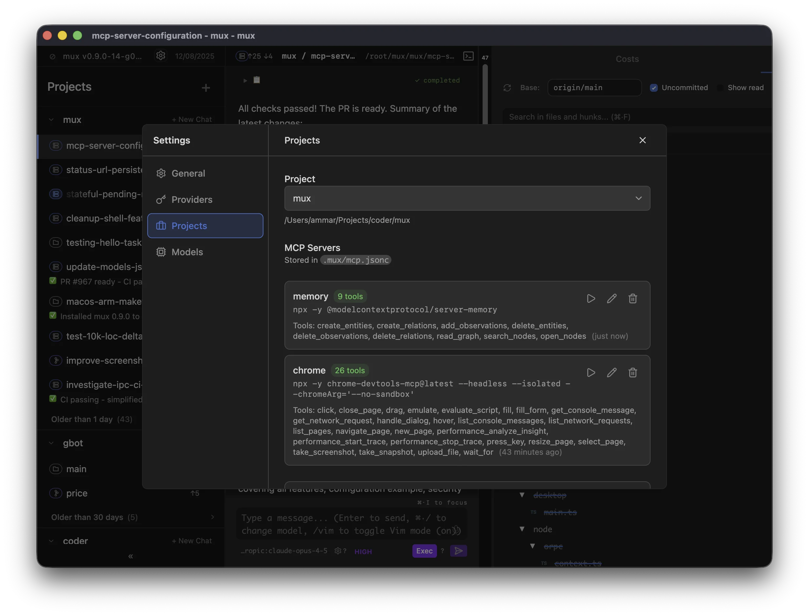

MCP (Model Context Protocol) servers provide additional tools to agents. Configure them per-project in `.mux/mcp.jsonc`.

## Configuration

You can either configure the servers in the UI (`Ctrl+,`):



Or directly in the `.mux/mcp.jsonc` file in your project root:

```jsonc
{
  "servers": {
    // Knowledge graph for persistent memory
    "memory": "npx -y @modelcontextprotocol/server-memory",
    // Browser automation and screenshots
    "chrome": "npx -y chrome-devtools-mcp@latest --headless",
  },
}
```

Each entry maps a server name to its shell command. The command must start a process that speaks MCP over stdio (NDJSON format).

## Slash Commands

Manage MCP servers directly from chat:

| Command                      | Description                         |
| ---------------------------- | ----------------------------------- |
| `/mcp add <name> <command>`  | Add a new MCP server                |
| `/mcp remove <name>`         | Remove an MCP server                |
| `/mcp edit <name> <command>` | Update an existing server's command |

Examples:

```
/mcp add memory npx -y @modelcontextprotocol/server-memory
/mcp add chrome npx -y chrome-devtools-mcp@latest --headless
/mcp remove github
/mcp edit chrome npx -y chrome-devtools-mcp@latest --headless --isolated
```

## Scope

MCP servers have two scopes:

- **Configuration** is per-project — The `.mux/mcp.jsonc` file lives in your project root and applies to all workspaces created from that project
- **Runtime instances** are per-workspace — Each workspace runs its own server processes, so state in one workspace doesn't affect another

## Per-workspace overrides

Mux supports per-workspace MCP overrides (enable/disable servers and restrict tool allowlists) without modifying the project-level `.mux/mcp.jsonc`.

These overrides are stored in a workspace-local file: `.mux/mcp.local.jsonc`.

- This file is intended to be **gitignored** (it contains local-only workspace preferences)
- When mux writes this file, it also adds it to the workspace's local git excludes (`.git/info/exclude`) so it doesn't get accidentally committed
- Older mux versions stored these overrides in `~/.mux/config.json`; mux will migrate them into `.mux/mcp.local.jsonc` on first use

This means you configure servers once per project, but each workspace (branch) gets isolated server instances with independent state.

## Behavior

- **Hot reload** — Config changes apply on your next message (no restart needed)
- **Isolated** — Server processes run in the workspace directory with its environment
- **Lazy start** — Servers start when you send your first message in a workspace
- **Idle timeout** — Servers stop after 10 minutes of inactivity to conserve resources, then restart automatically when needed

## Finding MCP Servers

Browse available servers at [mcp.so](https://mcp.so/) or the [MCP servers repository](https://github.com/modelcontextprotocol/servers).

## Troubleshooting

If a server fails to start:

1. **Test the command manually** — Run the command in your terminal to verify it works
2. **Check dependencies** — Ensure required packages are installed (`npx -y` downloads on first run)
3. **Use the Test button** — Settings → Projects shows connection errors inline
