# Review 1.4 layouts — design reference

Visual reference for the layouts on the **Review 1.4** page of the
[Mux exploration Figma](https://www.figma.com/design/77wZXkwInI5lsOf4p2ovAh/Mux-exploration?node-id=500-10510).
Screenshots are exported from Figma and checked in under `assets/review-1.4-layouts/` so the
target design stays reviewable alongside the implementation, even if the Figma file moves on.

Design: Tracy Johnson. Assembled from the Figma page and its annotation notes.

## Design → code mapping

| Design element                                              | Code                                                                     |
| ----------------------------------------------------------- | ------------------------------------------------------------------------ |
| Workspace footer info bar (PR, drift, repo, branch, tokens) | `src/browser/components/ChatPane/WorkspaceFooterBar.tsx`                 |
| Workspace-title header ("Workspace title ⓘ")                | `src/browser/components/WorkspaceMenuBar/WorkspaceMenuBar.tsx`           |
| "Let's get building." creation hero                         | `src/browser/components/ProjectPage/ProjectPage.tsx`                     |
| Sidebar workspace rows / status dots / sub-agent rails      | `src/browser/components/AgentListItem/` (Code Connect-mapped from Figma) |
| Project rows, pinned chats, sections                        | `src/browser/components/ProjectSidebar/ProjectSidebar.tsx`               |
| Workspace/chat kebab actions                                | `src/browser/components/WorkspaceActionsMenuContent/`                    |
| Agent mode selector ("Auto: Plan")                          | `src/browser/components/AgentModePicker/AgentModePicker.tsx`             |
| Composer pills (model, context meter, attach/mic/send)      | `src/browser/features/ChatInput/`                                        |
| Right panel tabs + terminal tabs                            | `src/browser/features/RightSidebar/`                                     |

## Top-level layouts

### Working workspace ("start")

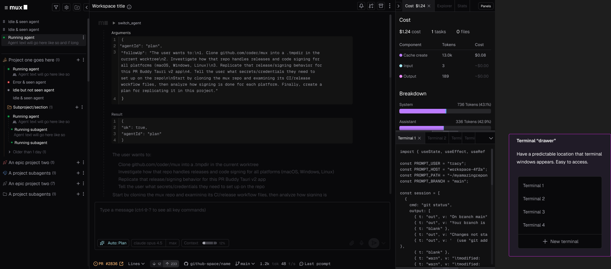

[View in Figma](https://www.figma.com/design/77wZXkwInI5lsOf4p2ovAh/Mux-exploration?node-id=508-22645)

- Three-column shell: a left project sidebar (272px), a fluid center chat column, and a right panel (303px). Both side columns have collapse chevrons at their inner edges of the center column's header.
- The left sidebar lists projects as collapsible trees ("Project one goes here", "An epic project two", "A project subagents", plus a "Subproject/section" group). Each workspace row shows a colored status dot and a state label (Running agent, Idle & seen agent, Idle but not seen agent, Error & seen agent), with a secondary line of agent text under active rows and an "Older than 1 day" collapsed group. Per-project "+" and overflow menus sit on the row's right edge; filter, settings, and new-project icons sit in the sidebar header next to the mux logo.
- The center column stacks four regions: a header bar with the workspace title (plus info icon and right-aligned action icons and an overflow menu), the scrolling transcript, the composer, and a bottom footer info bar.
- The transcript shows a collapsed tool call ("switch_agent") expanded to reveal syntax-highlighted "Arguments" and "Result" JSON blocks, followed by streamed assistant prose. The composer has placeholder text "Type a message (ctrl-⇧-? to see all key commands)" and a pill row: "Auto: Plan" mode pill, model pill ("claude opus 4.5" with "max" thinking), and a "Context 12%" usage meter, with attach, mic, and send controls on the right.
- The footer info bar surfaces workspace vitals in one line: PR #2836 link, "Lines" dropdown with diff counts (down 12 / up 233), the GitHub repo ("github-space/name"), branch ("main") dropdown, token stats ("1.2k tok, 48 t/s"), and a "Last prompt" affordance.
- The right panel is tabbed: Cost (active, showing "$1.24"), Explorer, Stats, and a "Panels" control. The Cost tab shows totals ($1.24 cost, 1 tasks, 0 files), a Component/Tokens/Cost table (Cache create, Input, Output), and a "Breakdown" section with proportional bars (System 736 tokens 43.1%, Assistant 336 tokens 42.9%). Below it, a terminal drawer with tabs (Terminal 1-4, overflow chevron) shows live terminal output. A designer note card explains the intent of the terminal "drawer": give terminal windows a predictable, easy-to-access location, with a tab list plus a "New terminal" action.

### First-run / creation state ("start V2")

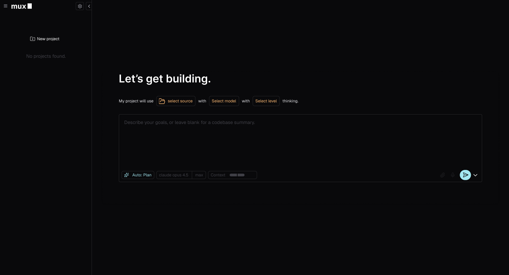

[View in Figma](https://www.figma.com/design/77wZXkwInI5lsOf4p2ovAh/Mux-exploration?node-id=764-1934)

- When no projects exist, the left sidebar collapses to a minimal state: the mux logo, a settings icon, a "New project" button, and the muted text "No projects found." The right panel is absent; the center column fills the remaining width.
- The creation flow is centered vertically with a large headline: "Let's get building."
- Below the headline sits a sentence-style configurator: "My project will use [select source] with [Select model] with [Select level] thinking." The three selects render as amber-outlined pill buttons inline with the plain sentence text; "select source" carries a folder icon.
- Under the sentence is a large prompt input with the placeholder "Describe your goals, or leave blank for a codebase summary." — i.e., submitting with an empty prompt is a valid path that produces a codebase summary.
- The input's bottom pill row mirrors the working composer: "Auto: Plan" mode pill, model pill ("claude opus 4.5" with "max"), and a "Context" meter, with attach and mic icons (disabled/muted) and a prominent cyan circular send button plus a dropdown chevron on the right.

## Left sidebar / project pane

### Empty state (no projects)

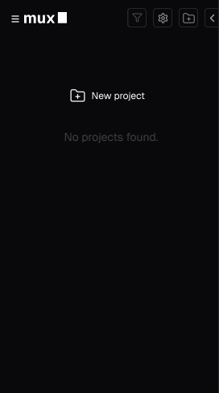

[View in Figma](https://www.figma.com/design/77wZXkwInI5lsOf4p2ovAh/Mux-exploration?node-id=808-106574)

- Header row: hamburger menu + mux wordmark on the left; funnel (filter), settings gear, new-project (folder-plus), and collapse-panel icons on the right.
- Body is centered on a single "New project" action (folder-plus icon + label) with muted "No projects found." text beneath it.
- No list chrome renders until a project exists; the pane stays otherwise blank.

### Collapsed project list

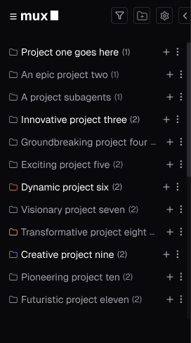

[View in Figma](https://www.figma.com/design/77wZXkwInI5lsOf4p2ovAh/Mux-exploration?node-id=809-108269)

- Each collapsed project is one row: folder icon, project name, and a muted workspace count in parentheses, e.g. "Innovative project three (2)".
- Folder icons can be colorized per project (red "Dynamic project six", amber "Transformative project eight", purple "Creative project nine"); the default is a neutral outline folder.
- Rows expose a "+" (new chat/workspace in that project) and a kebab overflow menu on the right.
- Long names truncate with an ellipsis rather than wrapping.

### Expanded project

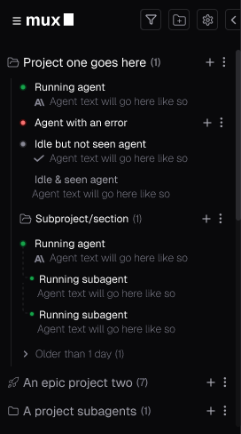

[View in Figma](https://www.figma.com/design/77wZXkwInI5lsOf4p2ovAh/Mux-exploration?node-id=808-106615)

- An expanded project uses an open-folder icon and lists its workspace rows underneath: running (green dot), error (red dot), idle-not-seen (grey dot), and idle-and-seen (no dot, greyed text).
- User-created workspaces show an optional muted second line of agent text, prefixed by a small agent/status icon (e.g. a checkmark on completed rows).
- A nested "Subproject/section (1)" behaves like a project inside a project, with its own "+"/kebab controls and running-agent rows.
- Running subagents nest under their parent workspace with dotted vertical line indicators and their own green status dots.
- Chats older than one day collapse into a disclosure group: "Older than 1 day (1)".
- Sibling projects below stay collapsed as single rows ("An epic project two (7)", "A project subagents (1)").

### Empty project

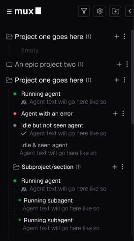

[View in Figma](https://www.figma.com/design/77wZXkwInI5lsOf4p2ovAh/Mux-exploration?node-id=821-152491)

- A project with no chats still expands, showing a single muted "Empty" placeholder row indented under the project name.
- The header keeps its count "(1)" formatting and "+"/kebab controls, so creating the first chat is one click away.
- The frame contrasts the empty project directly against a fully populated one to show both share identical header treatment.

### Pinned chats above the project area

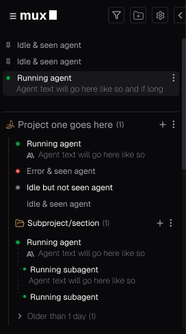

[View in Figma](https://www.figma.com/design/77wZXkwInI5lsOf4p2ovAh/Mux-exploration?node-id=808-106964)

- Pinned chats live in a dedicated strip at the very top of the pane, outside and above any project; idle pinned rows show a pin glyph where the status dot would be.
- A pinned running chat renders as the active-row treatment: dark grey highlighted background, white title, green status dot, kebab menu, and a second line of agent text.
- Below the pinned strip, the project area proceeds as usual (custom project icon, status rows, subproject with subagents, "Older than 1 day (1)" group), i.e. pinning does not change project rendering.

### Pinned chats (design note)

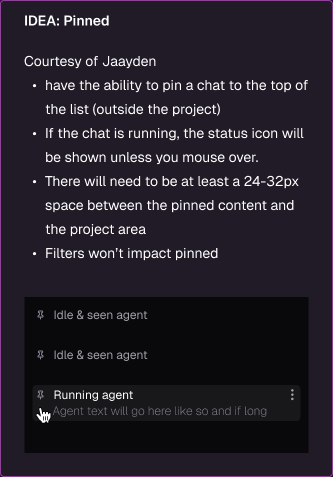

[View in Figma](https://www.figma.com/design/77wZXkwInI5lsOf4p2ovAh/Mux-exploration?node-id=689-16069)

- Idea credited to Jaayden: users can pin a chat to the top of the list, outside its project.
- If a pinned chat is running, its status icon shows; the pin glyph appears only on mouse-over (the mock shows a cursor hovering the running row).
- Reserve at least 24-32px of space between the pinned content and the project area.
- Filters must not affect pinned chats — they always stay visible.

### Workspace row anatomy

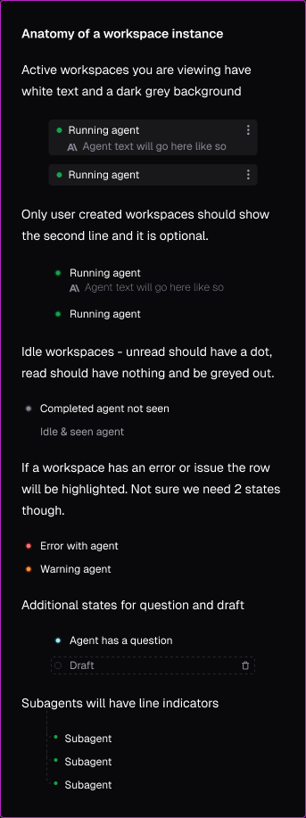

[View in Figma](https://www.figma.com/design/77wZXkwInI5lsOf4p2ovAh/Mux-exploration?node-id=636-255588)

- Active (currently viewed) workspaces get white text on a dark grey background; only user-created workspaces show the optional second line of agent text.
- Idle rows distinguish unread from read: unread ("Completed agent not seen") keeps a grey dot; read ("Idle & seen agent") has no dot and is greyed out.
- Error/issue rows are highlighted: red dot for "Error with agent", orange dot for "Warning agent" — the designer notes uncertainty about whether two separate states are needed.
- Additional states: "Agent has a question" uses a cyan/teal dot; "Draft" renders as a dashed-border row with a hollow circle and a trash icon to discard it.
- Subagents always render with dotted vertical line indicators connecting them to their parent row.

### Fully loaded / customized pane

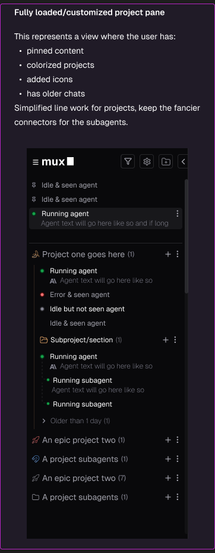

[View in Figma](https://www.figma.com/design/77wZXkwInI5lsOf4p2ovAh/Mux-exploration?node-id=689-17621)

- Represents the maximal state: the user has pinned content, colorized projects, added custom project icons, and accumulated older chats.
- Designer direction: use simplified line work for projects and keep the fancier dotted connectors for the subagents only.
- Custom icons replace the folder glyph per project (rocket for "An epic project two", swirl for "A project subagents"), while uncustomized projects keep the plain folder.
- All prior mechanics (pinned strip, status dots, "Older than 1 day" group, counts) compose together without layout changes.

### Left column frame (filter affordance)

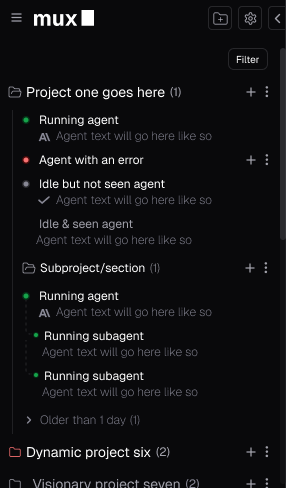

[View in Figma](https://www.figma.com/design/77wZXkwInI5lsOf4p2ovAh/Mux-exploration?node-id=834-154410)

- Canonical "Left column" frame; a "Filter" tooltip is shown anchored under the header's funnel icon.
- Confirms header icon order and the full stack: expanded project, subproject with subagent connectors, "Older than 1 day (1)" group, then collapsed colored projects ("Dynamic project six (2)" in red, "Visionary project seven (2)").

### Refine (group / sort) idea

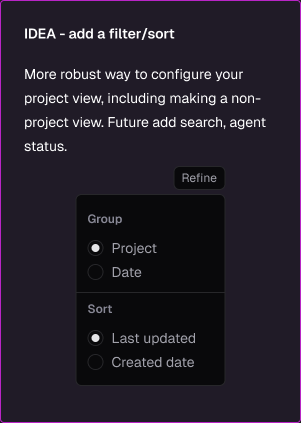

[View in Figma](https://www.figma.com/design/77wZXkwInI5lsOf4p2ovAh/Mux-exploration?node-id=690-18116)

- Idea: a "Refine" control giving a more robust way to configure the project view, including a non-project view; future additions could be search and agent-status filters.
- The mock popover has two radio groups: Group (Project | Date) and Sort (Last updated | Created date), defaulting to Project + Last updated.
- Grouping by Date is what produces chronological buckets like the "Older than 1 day" group instead of project nesting.

## Menus & selectors

### Mux kebab (global app menu)

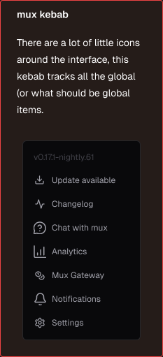

[View in Figma](https://www.figma.com/design/77wZXkwInI5lsOf4p2ovAh/Mux-exploration?node-id=634-249608)

- Designer rationale: there are a lot of little icons scattered around the interface; this kebab consolidates all global (or should-be-global) items into one menu.
- The menu opens with a dimmed version string header (`v0.17.1-nightly.61`).
- Items, each with a leading icon: Update available, Changelog, Chat with mux, Analytics, Mux Gateway, Notifications, Settings.
- Update-related items (Update available, Changelog) sit directly under the version header, grouping release info together.

### Project/folder kebab

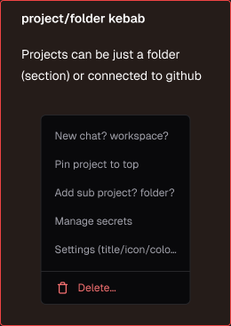

[View in Figma](https://www.figma.com/design/77wZXkwInI5lsOf4p2ovAh/Mux-exploration?node-id=634-250492)

- Designer rationale: projects can be just a folder (a section) or connected to GitHub, so the same kebab serves both.
- Items: "New chat? workspace?" (naming still open), "Pin project to top", "Add sub project? folder?" (also open naming), "Manage secrets", and "Settings (title/icon/colo...)" for editing the project's title, icon, and color.
- "Delete..." is separated at the bottom as a destructive action, rendered in red with a trash icon.
- Two item labels still carry designer question marks (chat vs. workspace, sub project vs. folder), so final copy is unresolved.

### Workspace/chat kebab

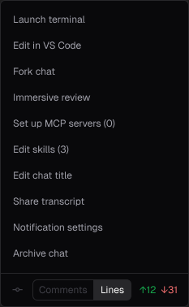

[View in Figma](https://www.figma.com/design/77wZXkwInI5lsOf4p2ovAh/Mux-exploration?node-id=693-15051)

- Items, top to bottom: Launch terminal, Edit in VS Code, Fork chat, Immersive review, Set up MCP servers (0), Edit skills (3), Edit chat title, Share transcript, Notification settings, Archive chat.
- MCP servers and skills show live counts in parentheses so the state is visible before opening.
- The footer is a git line: a commit glyph on the left, a "Comments | Lines" segmented toggle (Lines active in this frame), and diff stats "+12" in green and "-31" in red.
- Compared with the earlier note iteration (below), this frame drops "Subagent history" and renames "Rename chat" to "Edit chat title" and "Immersive code review" to "Immersive review".

### Workspace/chat kebab — designer notes

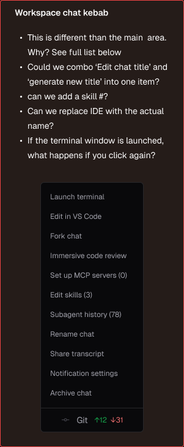

[View in Figma](https://www.figma.com/design/77wZXkwInI5lsOf4p2ovAh/Mux-exploration?node-id=634-250629)

- Earlier iteration of the same menu, including "Immersive code review", "Subagent history (78)", and "Rename chat"; its footer reads "Git +12 -31" without the Comments/Lines toggle.
- Open questions from the designer: this menu differs from the main area — why?; could "Edit chat title" and "generate new title" combine into one item?; can a skill count ("skill #") be added?; can "IDE" be replaced with the actual editor name (the newer frame answers this with "Edit in VS Code")?
- Also flagged: if the terminal window is already launched, what happens when "Launch terminal" is clicked again? Behavior needs a defined answer (focus existing vs. spawn new).

### Sidebar refine drop-down (unfolded)

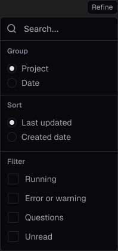

[View in Figma](https://www.figma.com/design/77wZXkwInI5lsOf4p2ovAh/Mux-exploration?node-id=818-112804)

- A compact "Refine" button opens this panel controlling how the sidebar's project/workspace list is displayed.
- Top row is a search field ("Search...") for filtering the list by text.
- "Group" section with radio options: Project (default-selected) or Date — i.e., group workspaces under their project or chronologically.
- "Sort" section with radio options: Last updated (default-selected) or Created date.
- "Filter" section with independent checkboxes: Running, Error or warning, Questions, Unread — surfacing only workspaces in those states.
- Radios enforce one grouping and one sort; filters are additive checkboxes.

### Agent mode selector

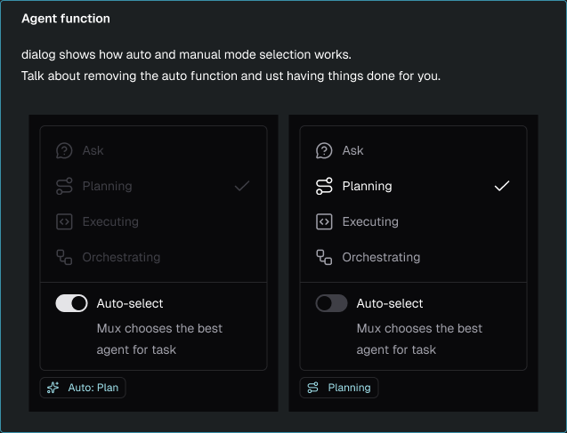

[View in Figma](https://www.figma.com/design/77wZXkwInI5lsOf4p2ovAh/Mux-exploration?node-id=634-251125)

- The dialog shows how automatic and manual mode selection work; the note asks to discuss removing the auto function entirely and just having things done for you.
- Four agent modes, each with an icon: Ask, Planning, Executing, Orchestrating.
- Auto-select ON (left state): the four mode rows render dimmed/disabled while a checkmark still marks the mode Mux currently picked (Planning); the toggle's caption reads "Mux chooses the best agent for task"; the collapsed trigger pill shows a sparkle icon with "Auto: Plan".
- Auto-select OFF (right state): mode rows are fully interactive, the checkmark marks the manual choice (Planning), and the pill shows the mode's own icon with the label "Planning".
- The pill therefore always communicates who chose the mode: "Auto: <mode>" when Mux decides, plain mode name when the user does.

## Main chat area, transcript & footer bar

### Chat column: header, transcript, composer, footer

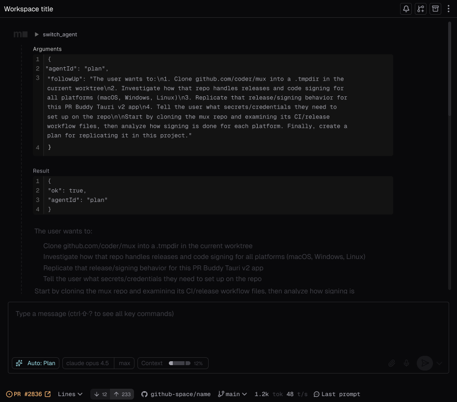

[View in Figma](https://www.figma.com/design/77wZXkwInI5lsOf4p2ovAh/Mux-exploration?node-id=663-257313)

- **Header** — a compact single row: "Workspace title" on the left (in the full app layout a small info icon follows the title), with right-aligned icon actions: bell (notifications), fork-with-plus (fork the workspace), archive, and a kebab overflow menu. In the full layout a chevron panel toggle sits just past the kebab, at the boundary with the right panel.
- **Tool-call rendering** — a collapsible `switch_agent` row with a disclosure triangle; the Mux shorthand logo marks the agent turn and a thin vertical rail runs down the left edge of the turn's content, visually grouping the expanded body under the tool-call header.
- **Arguments / Result blocks** — each renders as a labeled, line-numbered code block on the code background (the example shows the `agentId`/`followUp` JSON payload and a `{"ok": true, "agentId": "plan"}` result). Blocks are height-capped (~200px) and scroll internally instead of growing unbounded.
- **De-emphasized history** — earlier transcript content (the "The user wants to:" prompt with its numbered list) renders in low-contrast gray below the tool call, keeping focus on the active/latest activity.
- **Composer** — placeholder "Type a message (ctrl-shift-? to see all key commands)". Bottom-left pills: a sparkle icon with "Auto: Plan" (highlighted agent-mode pill), a split model pill "claude opus 4.5 | max", and a "Context" pill with a segmented usage meter plus "12%". Bottom-right: attach (paperclip), mic, and a circular send button with an adjacent chevron dropdown.
- **Footer info bar** — a single strip at the very bottom: amber circle-dot status + "PR #2836" + external-link launch icon, a "Lines" dropdown, a drift badge ("down 12 / up 233"), GitHub icon + "github-space/name" repo, branch icon + "main" dropdown, "1.2k tok 48 t/s" token/throughput readout (units dimmed), and a "Last prompt" item.

### Footer info bar: overflow and configurability

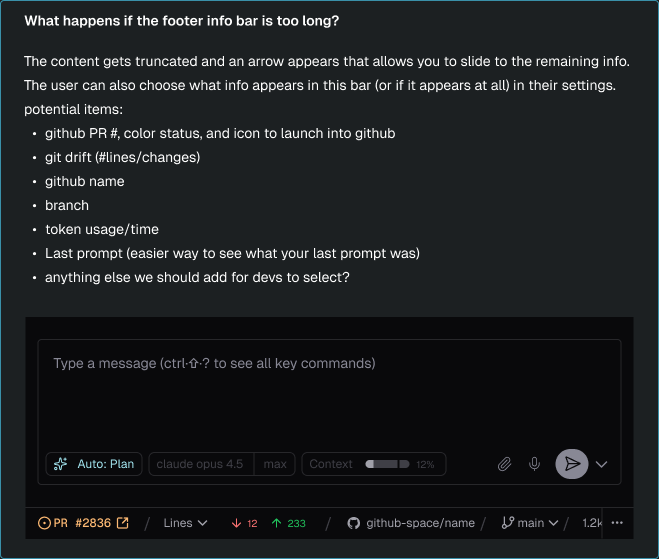

[View in Figma](https://www.figma.com/design/77wZXkwInI5lsOf4p2ovAh/Mux-exploration?node-id=636-256457)

- When the bar is too long, content truncates and an arrow appears that lets the user slide to the remaining info; the mock shows the bar cut off after "1.2k" with an ellipsis control pinned at the right edge.
- Users should be able to choose which items appear in the bar — or whether it appears at all — in their settings.
- Candidate items listed in the note: GitHub PR # with color status and an icon to launch into GitHub; git drift (# lines/changes); GitHub repo name; branch; token usage/time; and "Last prompt" (an easier way to see what your last prompt was).
- The note ends with an open question to the team: anything else we should add for devs to select?
- The mock separates items with slashes and color-codes state: amber PR status dot, red deletion count (down 12), green addition count (up 233).

## Right panel (panels & terminal)

### Right panel layout

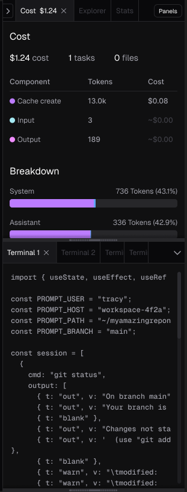

[View in Figma](https://www.figma.com/design/77wZXkwInI5lsOf4p2ovAh/Mux-exploration?node-id=663-257426)

- The right panel is a fixed 303px column split vertically: a panel area on top (tab strip + panel body) and a terminal section on the bottom. A collapse chevron sits at the far left of the tab strip.
- Tab strip anatomy: the active tab carries its live value inline ("Cost $1.24") plus a close x; inactive tabs ("Explorer", "Stats") are dimmed labels with no x. A bordered "Panels" button pinned at the right end opens the panel-visibility control (see the Panel visibility note below).
- Cost panel body: a "Cost" heading, then a stat row of three figures — "$1.24 cost", "1 tasks", "0 files" — with the numbers emphasized and the unit labels dimmed.
- Below the stat row, a Component / Tokens / Cost table where each component row has a colored dot (purple "Cache create" 13.0k $0.08, cyan "Input" 3, magenta "Output" 189). Near-zero amounts render as dimmed "~$0.00" rather than exact values.
- A "Breakdown" section follows: one row per message role (System 736 Tokens (43.1%), Assistant 336 Tokens (42.9%)), each with a right-aligned token count + percentage and a purple horizontal progress bar showing its share.
- Terminal section: its own tab strip with the active "Terminal 1" tab carrying a close x, "Terminal 2" dimmed, further tabs clipped to overflow stubs ("Termi…"), and a chevron button at the right edge that opens the terminal quick-pick. The terminal body below renders shell/editor output on a dark background.

### Terminal drawer

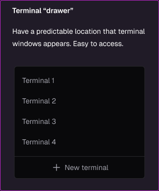

[View in Figma](https://www.figma.com/design/77wZXkwInI5lsOf4p2ovAh/Mux-exploration?node-id=634-249058)

- Designer note: terminals live in a "drawer" — a predictable location where terminal windows appear, easy to access, instead of terminals popping up in arbitrary places.
- The chevron at the right end of the terminal tab strip opens a quick-pick listing every open terminal (Terminal 1 through Terminal 4 in the mock), which handles the tab-strip overflow shown by the clipped stubs.
- The quick-pick ends with a "+ New terminal" row, so spawning another terminal happens from the same menu.

### Panel visibility

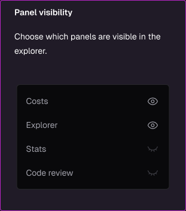

[View in Figma](https://www.figma.com/design/77wZXkwInI5lsOf4p2ovAh/Mux-exploration?node-id=634-249137)

- Designer note: choose which panels are visible in the explorer — this is what the "Panels" button in the tab strip opens.
- The control lists available panels (Costs, Explorer, Stats, Code review), each with an eye toggle on the right: open eye = shown (Costs, Explorer), closed eye = hidden (Stats, Code review).
- Hidden panels disappear from the tab strip entirely, keeping the strip to the tabs the user actually wants.

### Workspace functions

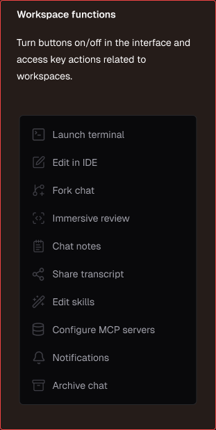

[View in Figma](https://www.figma.com/design/77wZXkwInI5lsOf4p2ovAh/Mux-exploration?node-id=634-249248)

- Designer note: turn buttons on/off in the interface and access key actions related to workspaces — a configuration surface for which workspace action buttons appear in the UI.
- Each action pairs an icon with a label: Launch terminal, Edit in IDE, Fork chat, Immersive review, Chat notes, Share transcript, Edit skills, Configure MCP servers, Notifications, Archive chat.
- The list doubles as an access point for the actions themselves, so functions toggled out of the toolbar remain reachable from here.

## Not yet implemented (tracked deviations)

- **"Cost" tab naming** — the design's right panel labels the cost tab `Cost $1.24`; the app
  currently labels it `Stats $1.24` (tab id `costs`). Rename pending a product-naming call.
- **Explorer tab and "Panels" visibility button** — no Explorer surface exists yet; panel
  visibility control is new functionality (see Panel visibility note).
- **Sidebar header icon row** (filter/Refine, settings, new-project, top collapse) — the
  Refine popover is a new feature, not just layout.
- **Footer bar customization**: the footer note calls for user-configurable items in
  settings; the bar currently ships a fixed item set.
- **Repository slug without a PR**: the footer shows the real GitHub slug only once PR
  detection has resolved one, and falls back to the local project label otherwise. Resolving
  the slug straight from the git remote needs a new backend accessor plus a cached store, so
  a GitHub-backed branch with no PR yet still reads as the project label.
- **Sentence-style creation configurator** — "My project will use [source] with [model] with
  [level] thinking." maps onto `CreationControls`, which carries runtime/policy/availability
  logic; restyling it is its own change.
- **Header action set**: the design shows notifications / fork / archive / kebab; the app keeps
  notifications, skills, open-in-editor, terminal, and kebab. Dropping shipped actions is a
  product call, not a layout one.
- **Drift glyphs**: the design renders drift as `↓12 ↑233`; the app reuses
  `GitStatusIndicator`'s `+/-` counts so the footer, sidebar, and divergence dialog stay
  consistent.
